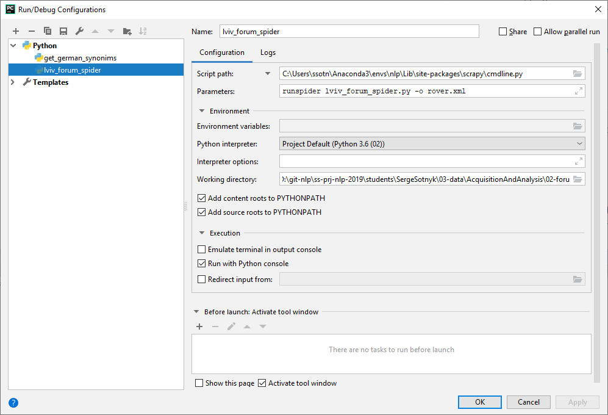

# Task

Download and extract as separate texts all posts in a section of choice 
from http://forum.lvivport.com. The task requires web scraping.

# Solution
All necessary code is placed in lviv_forum_spider.py. Theme named "Велодоріжка" 
was selected for scrapping because it is not very large, but has multi-paged topics.
Scrapy framework is used to collecting forum content. Run the following command to
get the results as xml file.

```scrapy runspider lviv_forum_spider.py -o rover.xml```

Note fo me: 

Following pycharm configuration can be used to debug spider with pycharm IDE 



File requirements.txt contains many unused packages, but I don't want to waste my 
time to clear this list, sorry.

# Results

Collected data can be found in file rover.xml. Every item has three fields:

* author
* permalink
* article

Field **article** contains text with html tags because article often contains quotes, 
formatting, etc. We can remove these tags but it can be inappropriate for some tasks.
So, I leave this content as-is for preventing information lost.

