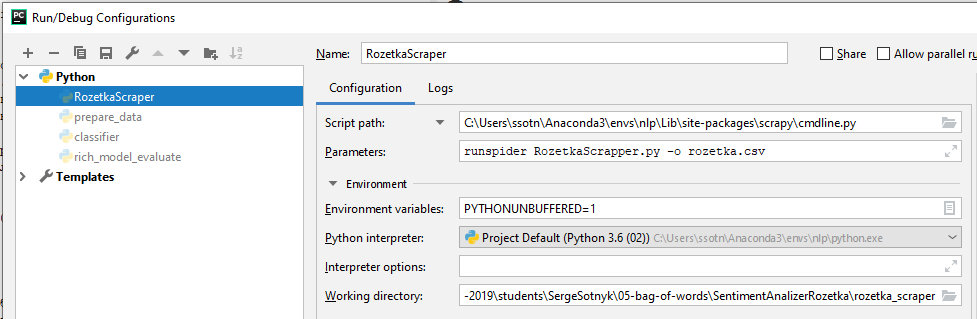

# Задача

### Сентимент-аналіз

Цього тижня ви побудуєте класифікатор для аналізу тональності тексту 
(позитивна, негативна чи нейтральна). Даними будуть споживацькі відгуки 
з сайту https://rozetka.com.ua/, написані українською мовою.

### Домен
* виберіть категорію товарів на https://rozetka.com.ua/
* зіскрейпіть відгуки користувачів разом із кількістю зірочок, яку поставив користувач
* відфільтруйте відгуки українською мовою, використавши будь-яку бібліотеку для 
визначення мови
* зберіть кілька тисяч відгуків та поділіть дані на тренувальні та тестувальні

### Класифікатор
* виберіть будь-який bag-of-words класифікатор (Naive Bayes, Averaged Perceptron, 
Logistic Regression, SVM, etc.) та імплементуйте першу версію сентимент-аналізу; 
поміряйте якість на тестовій вибірці
* використайте тональний словник для покращення якості класифікатора; поміряйте 
якість на тестовій вибірці
* спробуйте покращити якість роботи класифікатора іншими способами (фільтрування 
стоп-слів, використання лем слів, опрацювання заперечень, ваші варіанти)
* Запишіть ваші спостереження та результати в окремий файл.

Крайній термін: 6.04.2019 (100% за завдання)

# Рішення

## Скрейпер
Для скрейпінгу використано бібліотеку Scrapy. Модулі знаходяться в діректорії 
rozetka_scraper. Запуск скрейпінгу:

```
scrapy runspider RozetkaScrapper.py -o rozetka.csv
```

Для запуску в PyCharm використовуємо такі настройки:



В скрейпері у якості стартової сторінки задано розділ смартфонів. Скрейпер зберігає
тільки відгуки, які йдуть із зірками. Скрейпінг триває досить довго, оскільки середня 
швидкість обходу - біля 1 сек. на сторінку.

Після закінчення роботи скрейпера, отримуємо файл rozetka.csv (додав його до гітхаба,
стиснувши за допомогою 7z). Файл має такі поля:

    goods_code,stars,review,author,permalink

Тепер нам потрібно знайти в даних україномовні відгуки та розділити дані на навчальну
та тестову послідовності. Це робиться за допомогою модулю prepare_data. Просто
запускаємо його, та отримуємо 2 файла - rozetka_learn.csv (3800 відгуків) та 
rozetka_test.csv (1629 відгуків).

Ці файли перекидаємо до діректорії tone, де будемо робити подальшу обробку.

## Baseline
В ноутбуці classifier.ipynb, розташовано код бейзлайну - створення Bag-Of-Word з 
лемматизацією та викидуванням занадто розповсюджених та рідких термів. Підключав
стоп-слова (точніше їх фільтрацію), але вони не покращили классифікацію. Як і 
фільтрація термів не з букв. Классифікатор - BernoulliNB. 

Класи виявилися з перекосом в сторону 5 зірок. То ж, щоб трохи покращити ситуацію,
розділив відгуки на 3 класи - негативні (1..2 зірки), нейтральні (3..4 зірки) та 
позитивні (5 зірок).

Якість по класам та середня:
F1 = (0.3745, 0.3338, 0.7787), mean = 0.4957

## Додавання фіч

В модулі rich_model_evaluate.py можна знайти вхідну точку до біль "богатого" фічами 
классифікатора. Застосовується клас Pipeline та FeatureUnion з sklearn, та кастомні 
векторизатори. Застосовуються такі фічі:

* TfidfVectorizer - Bag-Of-Words kind features
* StatVectorizer - довжина тексту, кількість в ньому токенів та середня довжина 
токену.
* ToneVectorizer - формує вектор із чотирьох чисел, лічильників, скільки 
тоново-забарвлених слів є у відгуку (у словнику слова поділені на 4 типа)
* EmbVectorizer - формує вектор із середнього значення ембедінгів тексту відгуку. Для
обчислення ембедінгів використовується бібліотека BPEmb, яка має досить компактні 
словники для багатьох мов, у тому числі і для української. 

Також, було застосовано інший классифікатор - SGDClassifier, який дав найкращі 
результати із перевірених, але додав деяку нестабільність у цифрах. Може тому, що 
він стохастичний? :-)

Нажаль, не можу сказати, що якість поліпшилася принципово - в мене зосталися деякі 
питання, які я ще планую задати очно, на заняттях. Один пусків (не найгірший) дав
такий результат:

```
Precision score = [0.40295359 0.48780488 0.7751938 ], mean = 0.5553174209987611
 Accuracy score = 0.6451810926949049
   Recall score = [0.45803357 0.39473684 0.75471698], mean = 0.5358291321262751
       F1 score = [0.42873176 0.43636364 0.76481836], mean = 0.5433045846897557
```

Поки коммічу як є, бо вже термін спливає, але може ще будуть комміти...

## Ще трохи тюнингу

Після написання своїх L1 та L2 нормалайзерів, тюнингу вагів та класифікатора (змінив 
його на LogisticRegression, оскільки він майже не гірший, ніж SGD, але дає
стабільні результати), маю такі результати:

```
Precision score = [0.43298969 0.51724138 0.78044444], mean = 0.576891838158813
 Accuracy score = 0.6789441375076735
   Recall score = [0.4028777  0.39473684 0.82830189], mean = 0.5419721422464808
       F1 score = [0.4173913  0.44776119 0.80366133], mean = 0.5562712752029327
```