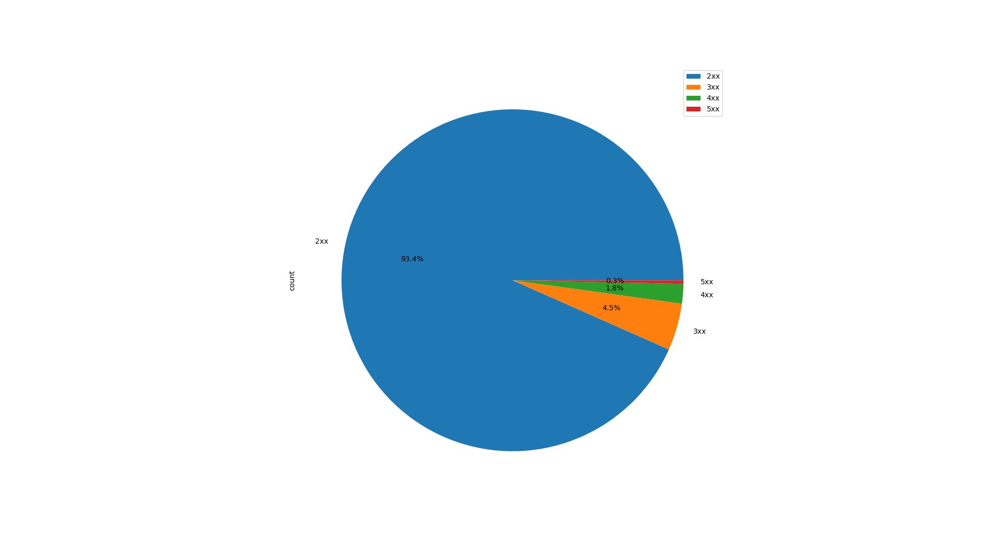
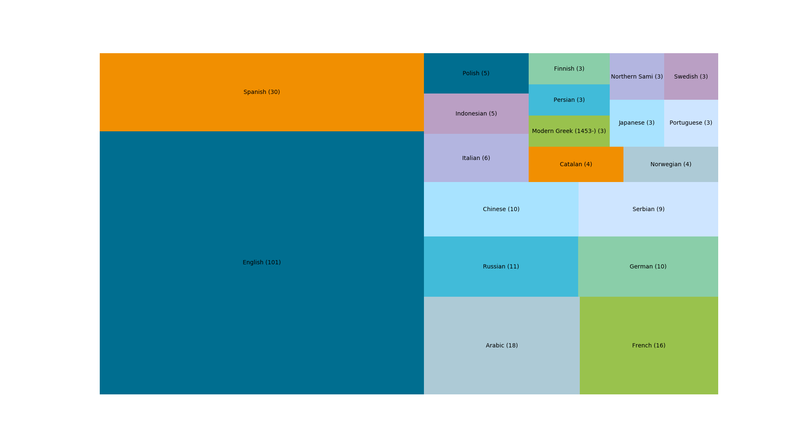

Всього було оброблено близько 30гб архивів з даними, в яких зберігалося близько 4млн записів. З них ~3млн були записами про веб-сторінки (`content-type=text/html`).

Приклад зібраних даних:

| code | language | region |
|------|----------|--------|
| 200  | en       | us     |
| 200  | ja       |        |
| 200  | en       | us     |
| 200  | en       | us     |
| 404  | en       | us     |
| 301  |          |        |
| 404  | cs       |        |
| 301  |          |        |
| 302  |          |        |
| 404  | is       | is     |
| 404  | is       | is     |
| 200  | en       | za     |
| 200  | en       |        |
| 200  | en       | us     |
| 200  |          |        |
| 200  | en       | us     |
| 200  |          |        |
| 200  | ar       | aa     |
| 200  | ar       | aa     |
| 200  | en       | us     |
| 200  | ja       |        |
| 200  |          |        |
| 200  | zh       | tw     |
| 200  | de       | de     |

Проаналізувавши html, маємо таке:
Дані розподілу http статус-кодів

Дані про кількість регіонів, в яких використовується та чи інша мова. Дані були зібрані зі сторінок, де була зазначена локаль (наприклад en_US вказує на англійську в США, pt_BR на португальську в Бразиліі і т.д.). В дужках вказана зігальна кількість різних регіонів.

